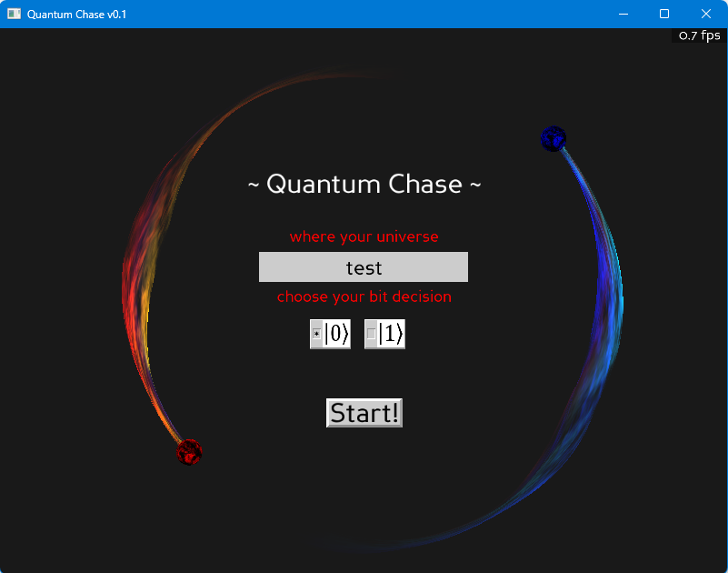
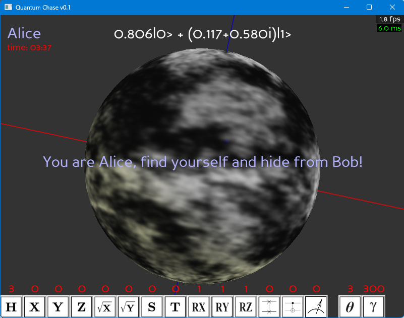
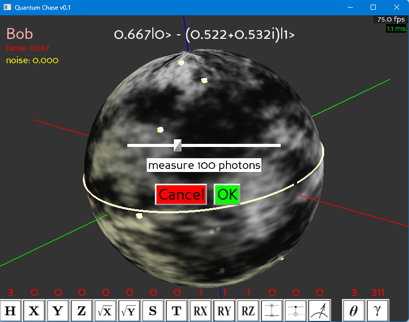
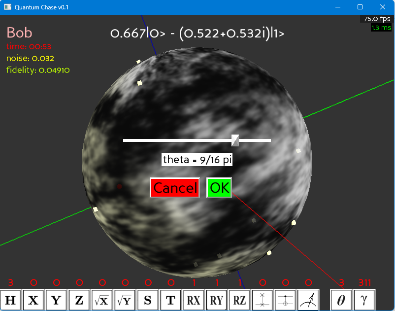
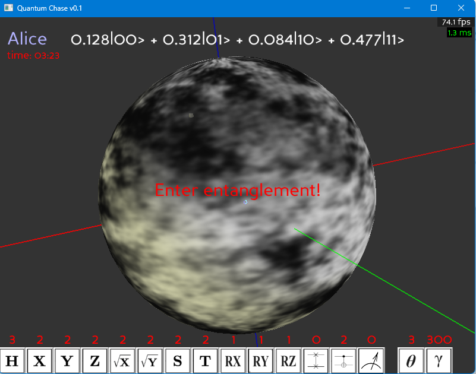

# Quantum Chase Game

    弧光量子云 第一届量子信息技术与应用创新大赛 基于量子计算机的游戏设计 (ArcLight-2023-Quantum-Game)

----

contest page: [https://qcloud.arclightquantum.com/#/competition/introduction](https://qcloud.arclightquantum.com/#/competition/introduction)

### gameplay

- Select a room and a classic bit to join the game
  - This bit will be used to deicde your game role through [quantum coin flipping](https://en.wikipedia.org/wiki/Quantum_coin_flipping)
- Two players playing the **hide and seek** on a [Bloch sphere](https://en.wikipedia.org/wiki/Bloch_sphere)
  - Player visibility is related to their [quantum state fidelity](https://en.wikipedia.org/wiki/Fidelity_of_quantum_states)
  - Alice should hide from Bob till the timer countdown
  - Bob must catch Alice in a limited time
- You will use [quantum teleportation](https://en.wikipedia.org/wiki/Quantum_teleportation) measurements to obtain rival's location info
- You will use the basic [quantum gates](https://en.wikipedia.org/wiki/List_of_quantum_logic_gates) to travel fast on the Bloch
- You can make [quantum entanglement](https://en.wikipedia.org/wiki/Quantum_entanglement) with CNOT gate, and explore everything
- This world is effected by stochastic [quantum noises](https://en.wikipedia.org/wiki/Quantum_noise)

### controls keys

- free move with `W/A/S/D`, the direction describing the latitude/longitude circle
- pick the spawn items with `Space`
- rotate the ball with Mouse clicks
- Mouse click the tool menu buttons

### screenshots

⚪ overview

| title | main |
| :-: | :-: |
|  |  |

⚪ mechanics

| qtele & measure | aplly rot gate | entangled state |
| :-: | :-: | :-: |
|  |  |  |

### how to run

- see REAME.md in both [server](server/README.md) and [client](cleint/README.md) folder, respectively

----
by Armit
2023/09/05
